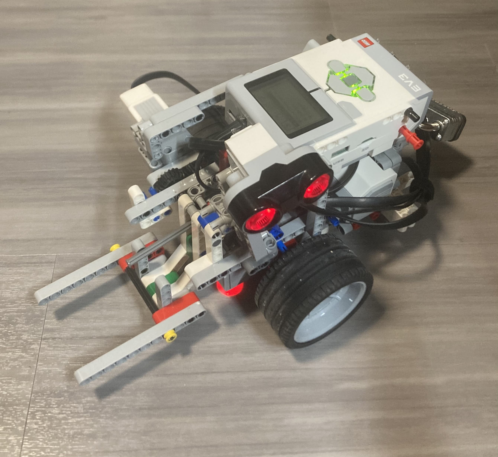

# ENED 1120 Autonomous Robot for Mobile TDP Plant  
**Spring 2025 – University of Cincinnati**

## 🌍 Project Overview

This project addresses the National Academy of Engineering (NAE) Grand Challenge:  
**Develop Carbon Sequestration Methods**

Our team designed and built a **semi-autonomous robot** prototype intended for use in a **mobile Thermal Depolymerization (TDP) plant**, which processes disaster debris into usable fuel. The robot autonomously classifies, lifts, and transports bins of material to their correct processing zones—contributing to disaster recovery while promoting environmental sustainability.

---

## 🤖 Robot Capabilities

- **Line following** using dual color sensors and a PID control system  
- **Weight-based material classification** (Light, Medium, Heavy) via lifting arm torque analysis  
- **Autonomous zone detection and drop-off** using ultrasonic sensors  
- **Touch sensor-triggered bin pickup** with dynamic arm movement  
- **Closed-loop operation** from pickup to drop-off and back

---

## 🧠 Key Features

- **PID-Controlled Navigation**: Custom LabVIEW PID code enabled reliable path tracking on solid and broken lines.
- **Dynamic Arm Control**: Motor power scaled based on error to ensure smooth and consistent lifts.
- **Weight Detection Algorithm**: Integrated into pickup sequence; identifies bin weight from accumulated motor effort.
- **Zone & Drop-off Logic**: Zone detection tracked using ultrasonic sensor pulses; triggered drop-offs based on bin class.
- **Professional Build & Documentation**: All decisions documented in an engineering notebook and tested thoroughly over multiple iterations.

---

## 🛠️ Technologies Used

- **LabVIEW 2016** for control logic and PID implementation  
- **LEGO Mindstorms EV3** for hardware architecture  
- **Desmos** for mathematical modeling of lifting curves  
- **Ultrasonic, Color, and Touch Sensors** for interaction and detection  
- **CAD & Rapid Prototyping** for custom bins and build components

---

## 📊 Final Demo Performance

- ✅ 100% Accuracy in Drop-offs  
- ✅ 100% Accuracy in Weight Detection (25g, 75g, 125g)  
- ✅ Fully operational pickup-dropoff loop  
- ❌ Missed Continuous Loop in Final Demo due to time constraint

---

## 🙌 Team Contributions

- **Mason Pyle** – Lead Programmer (PID, Arm Logic, Detection Systems)  
- **Alexandria Vardon** – Project Lead, CAD/Build, Documentation  
- **Molly Farrell** – Build, Testing, Presentation  
- **Chester Parker** – Mechanical Design, Fabrication, Demo Operations  

---

## 📽️ Demo Video/Picture
[**Watch the full demo on YouTube**](https://youtu.be/uCwxQbQjLqI)

---

## 📌 Notes

This repository is a proof-of-concept for educational purposes. The project demonstrates engineering design thinking, teamwork, and embedded system programming in response to real-world global challenges.

---

## 📜 License

This project is released for academic and portfolio use. All rights for LabVIEW files belong to the original creators and the University of Cincinnati curriculum authors.

